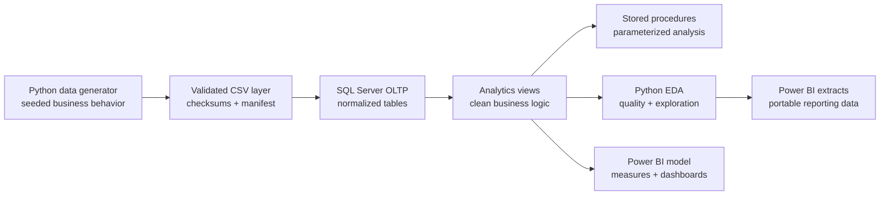
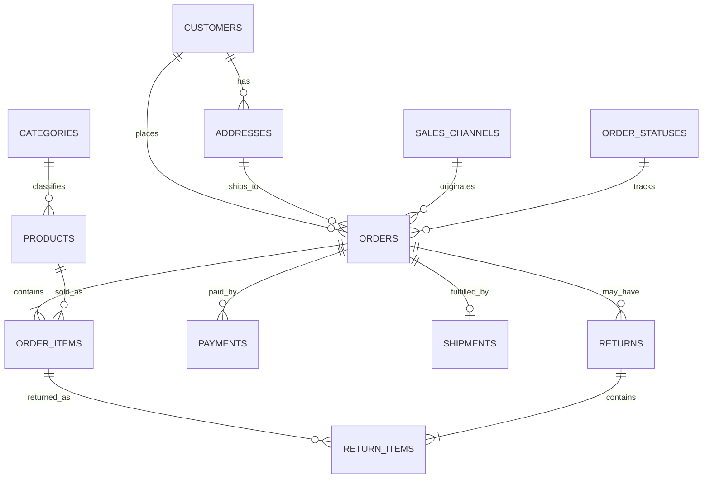
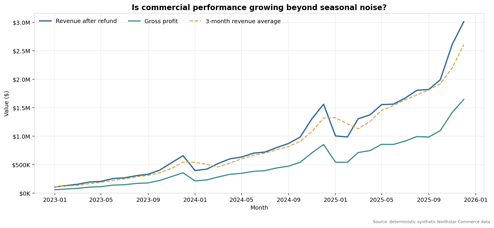
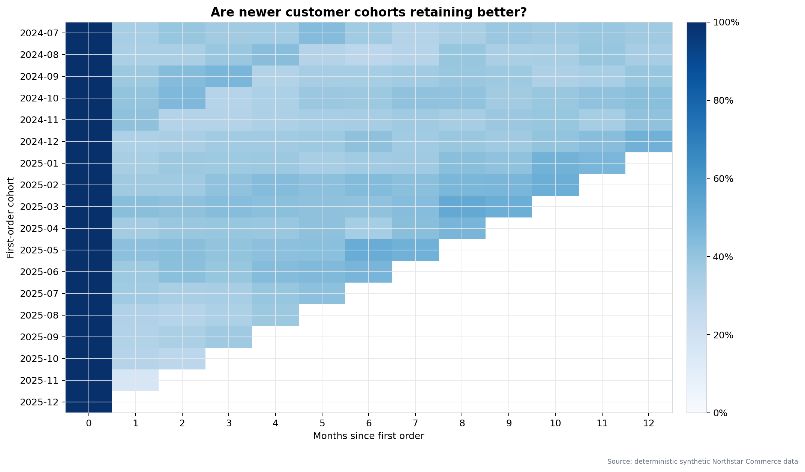

# Northstar Commerce Analytics

An end-to-end e-commerce analytics portfolio project built with **SQL Server, Python, and Power BI**. It models a realistic order lifecycle—from customer acquisition and payment to fulfillment, returns, and margin—and turns transactional data into decision-ready reporting datasets.


## Business problem

Northstar Commerce's leadership needs a reliable way to answer:

- Which products, categories, channels, and regions drive revenue and profit?
- Are repeat customers more valuable than one-time buyers?
- Where are fulfillment delays, cancellations, and returns hurting performance?
- How are revenue, average order value, and retention trending over time?
- Which customer cohorts and RFM segments deserve marketing attention?

## What this project demonstrates

- Normalized OLTP design with constraints, indexes, and referential integrity
- Deterministic synthetic data platform producing 120,000 orders and 250,000+ order lines
- Advanced T-SQL: CTEs, recursive CTEs, window functions, views, stored procedures, `PIVOT`, and cohort analysis
- Business analytics covering RFM, churn risk, CLV, cohort retention, market basket, campaign attribution, and Pareto concentration
- A curated reporting layer with stable business definitions
- Reproducible Python EDA, data-quality checks, visualizations, and CSV exports
- A Power BI-ready semantic model, measure library, and dashboard blueprint
- Clear translation from analysis to commercial recommendations

## Architecture



## Repository structure

```text
ecommerce-analytics/
├── data_generator/
│   ├── config.json
│   ├── catalogs.py
│   ├── generate.py
│   ├── validate.py
│   └── load_sql_server.py
├── sql/
│   ├── 00_create_database.sql
│   ├── 01_schema.sql
│   ├── 02_prepare_bulk_load.sql
│   ├── 03_views.sql
│   ├── 04_stored_procedures.sql
│   ├── 05_advanced_analysis.sql
│   └── 06_data_quality_checks.sql
├── python/
│   ├── ecommerce_eda.py
│   └── requirements.txt
├── data/
│   ├── processed/              # generated Power BI-ready CSVs
│   └── README.md
├── powerbi/
│   ├── MODEL_GUIDE.md
│   └── measures.dax
├── docs/
│   ├── DATA_DICTIONARY.md
│   ├── ER_DIAGRAM.md
│   ├── DATA_GENERATION.md
│   ├── BUSINESS_INSIGHTS.md
│   └── DASHBOARD_MOCKUP.md
├── reports/figures/            # generated EDA charts
├── .env.example
├── .gitignore
├── LICENSE
└── README.md
```

## Data model

The transactional layer is normalized to third normal form. Order line prices are snapshotted to preserve historical truth; product list prices may change without rewriting past orders.



See [the detailed ER diagram](docs/ER_DIAGRAM.md) and [data dictionary](docs/DATA_DICTIONARY.md).

## Quick start

For the complete Windows walkthrough, prerequisites, Power BI relationship matrix, and manual acceptance steps, use [SETUP_GUIDE.md](SETUP_GUIDE.md).

```powershell
py -3.11 -m venv .venv
.\.venv\Scripts\Activate.ps1
pip install -r python\requirements.txt
Copy-Item .env.example .env
python -m unittest discover -s tests -v
python -m data_generator.generate
python -m data_generator.validate
```

Deploy `sql/00_create_database.sql` and `sql/01_schema.sql` in SSMS, load the data with `python -m data_generator.load_sql_server`, then deploy the analytics scripts. The database creation script is destructive and must be used only on a disposable local development database.

### 1. Build the SQL Server database

Requirements: SQL Server 2019+ and SQL Server Management Studio or Azure Data Studio.

Create the database objects first:

```text
sql/00_create_database.sql
sql/01_schema.sql
```

Generate and validate the dataset, then load it into SQL Server:

```bash
python -m data_generator.generate
python -m data_generator.validate
python -m data_generator.load_sql_server
```

Finally, deploy the analytics layer and run the quality suite:

```text
sql/03_views.sql
sql/04_stored_procedures.sql
sql/05_advanced_analysis.sql   -- optional: analysis result sets
sql/06_data_quality_checks.sql
```

The default deterministic build creates **12,000 customers, 600 products, 120,000 orders, and more than 250,000 order lines** across 2023–2025. It also produces payments, shipments, returns, verified product reviews, promotions, and campaign interactions. See [the data-generation architecture](docs/DATA_GENERATION.md).

### 2. Run parameterized SQL analysis

```sql
EXEC analytics.usp_SalesPerformance
    @StartDate = '2025-01-01',
    @EndDate = '2025-12-31',
    @ChannelName = NULL;

EXEC analytics.usp_Customer360 @CustomerId = 17;
EXEC analytics.usp_RefreshRfmSegments @AsOfDate = '2025-12-31';
EXEC analytics.usp_ProductAffinity
    @StartDate = '2025-01-01',
    @EndDate = '2025-12-31',
    @MinimumPairOrders = 25,
    @TopN = 50;
```

See [the SQL analytics catalog](sql/README_ANALYTICS.md) for metric semantics and business interpretation. Execution-plan guidance and scale risks are documented in the [SQL Server performance guide](docs/SQL_PERFORMANCE.md).

### 3. Run Python EDA

Create an environment and install the pinned dependencies:

```bash
python -m venv .venv
# Windows: .venv\Scripts\activate
# macOS/Linux: source .venv/bin/activate
pip install -r python/requirements.txt
python python/ecommerce_eda.py
```

The pipeline reads the deterministic transactional CSVs directly, validates data contracts, reconciles SQL-aligned metrics, writes 12 charts to `reports/figures/`, creates an executive report, and exports Power BI-ready tables to `data/processed/`. See the [Python EDA guide](docs/PYTHON_EDA.md) and the generated [executive summary](reports/EXECUTIVE_SUMMARY.md).

## Reproduce the project

A reproducible build uses the pinned Python dependencies, generator seed `20260721`, and the checked-in configuration files. From a clean clone:

1. Complete the Python and SQL Server setup in [SETUP_GUIDE.md](SETUP_GUIDE.md).
2. Generate and validate `data/generated/`.
3. Load SQL Server and deploy the analytics objects.
4. Run `python python\ecommerce_eda.py` to rebuild reports, charts, and Power BI exports.
5. Run `python -m unittest discover -s tests -v` and `python scripts\check_repository.py`.
6. Build the Power BI model using the documented CSV names and relationship matrix.
7. Record manual SQL Server and Power BI evidence in [the deployment validation checklist](docs/DEPLOYMENT_VALIDATION.md).

Generated source data, processed CSVs, credentials, Power BI binaries, database files, backups, virtual environments, and local logs are deliberately excluded from version control. The repository stores the code, configuration, governed definitions, compact reports, and documentation required to reproduce them.

## Analysis highlights





### 4. Build the Power BI report

Connect Power BI Desktop to SQL Server or the deterministic CSV extracts. Follow [the semantic model guide](powerbi/MODEL_GUIDE.md), configure sources with the [Power Query guide](powerbi/POWER_QUERY_GUIDE.md), create the governed layer from [measures.dax](powerbi/measures.dax), apply [the report theme](powerbi/theme.json), and implement the seven-page [dashboard blueprint](docs/DASHBOARD_MOCKUP.md). The [measure dictionary](powerbi/MEASURE_DICTIONARY.md) documents business definitions, formats, and non-additive metric warnings.

## Key analytics outputs

| Asset | Grain | Use case |
|---|---|---|
| `analytics.vw_OrderLineAnalytics` | One row per order line | Product, category, channel, margin analysis |
| `analytics.vw_OrderSummary` | One row per order | Revenue, AOV, fulfillment, customer behavior |
| `analytics.vw_CustomerMetrics` | One row per customer | LTV, repeat rate, segmentation |
| `analytics.vw_MonthlyKpis` | One row per month | Executive trends and targets |
| `analytics.vw_MonthlyPerformance` | One row per month | MoM, YoY, rolling, and cumulative performance |
| `analytics.vw_CohortRetention` | One row per cohort/elapsed month | Retention curves |
| `analytics.vw_ProductPerformance` | One row per product | Revenue, profit, returns, discounts, and reviews |
| `analytics.vw_ReturnAnalysis` | One row per returned line | Return rate, reasons, refund exposure |
| `analytics.DimDate` | One row per date | Power BI calendar relationships |

## Business definitions

- **Gross revenue:** quantity × unit price before discount
- **Net revenue:** gross revenue − line discount; excludes cancelled orders
- **Revenue after refund:** net revenue − non-rejected refunds
- **Gross profit:** net revenue − product cost; excludes shipping expense and tax
- **AOV:** net revenue ÷ distinct non-cancelled orders
- **Repeat customer:** customer with at least two non-cancelled orders
- **Return rate:** returned units ÷ fulfilled units
- **On-time delivery:** delivered on or before the promised date

Definitions are centralized in analytics views to avoid metric drift.

Customer projected value is an explainable annualized after-refund revenue run rate. It is intentionally presented as a transparent planning metric rather than a predictive machine-learning claim.

## Illustrative findings

The included seed data is synthetic, so exact values should be regenerated locally. The analysis is designed to surface findings such as:

- Revenue concentration by category and the margin trade-off behind top sellers
- Repeat-customer revenue contribution and cohort retention decay
- Regions or carriers with disproportionate delivery delays
- Product-level return hotspots that may signal quality or expectation issues
- Channel mix shifts and discount dependency

See [business insights and recommendations](docs/BUSINESS_INSIGHTS.md) for the decision framework.

## Quality and reproducibility

- Fixed seed logic produces the same dataset on every rebuild
- SHA-256 checksums and a manifest make every generated table auditable
- Scale and behavioral tests validate repeat purchase, multi-line baskets, and seasonality
- SQL constraints prevent invalid quantities, negative money values, and broken relationships
- Data-quality queries test uniqueness, completeness, reconciliation, and chronology
- Python data contracts fail fast on duplicate keys, unexpected nulls, orphan relationships, invalid ranges, and metric mismatches
- Unit tests cover deterministic generation, MoM/YoY calculations, RFM scoring, configuration, and SQL contracts
- `.env` credentials and generated artifacts are excluded from version control

Run the generator tests with:

```bash
python -m unittest discover -s tests -v
```

Run the delivery audit with:

```bash
python scripts/check_repository.py
```

## Project documentation

- [Windows setup and deployment](SETUP_GUIDE.md)
- [SQL and Power BI acceptance checklist](docs/DEPLOYMENT_VALIDATION.md)
- [Power BI manual build checklist](docs/POWER_BI_MANUAL_CHECKLIST.md)
- [SQL analytics catalog](sql/README_ANALYTICS.md)
- [Python EDA guide](docs/PYTHON_EDA.md)
- [Power BI semantic model](powerbi/MODEL_GUIDE.md)
- [Contributing guidelines](CONTRIBUTING.md)
- [Changelog](CHANGELOG.md)

## Future enhancements

- Add incremental loading and orchestration with Azure Data Factory
- Introduce campaign cost data for CAC/ROAS analysis
- Add inventory snapshots for stockout and sell-through analysis
- Publish a Power BI Service report with row-level security
- Add automated SQL tests in CI

## Author

**Ü.Gülsüm Utlu**  
Data Analyst / BI Developer

- **LinkedIn:** [linkedin.com/in/utlu-uu09](https://www.linkedin.com/in/utlu-uu09)
- **GitHub / Portfolio:** [github.com/utluuu](https://github.com/utluuu)
- **Email:** [utlu.uu09@gmail.com](mailto:utlu.uu09@gmail.com)

*This project was built to demonstrate end-to-end data analytics, SQL, Python, and Power BI capabilities.*

## License

MIT License — see [LICENSE](LICENSE).
