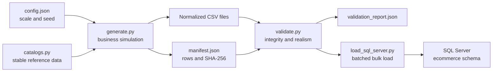

# Synthetic Data Generation Architecture

## Purpose

The generator creates a large, relational, reproducible e-commerce dataset without storing oversized SQL `INSERT` scripts or using real personal data. Its goal is analytical realism: related business events are generated from shared customer, product, promotion, order, and fulfillment behavior.

## Pipeline



## Default scale

| Entity | Rows |
|---|---:|
| Customers | 12,000 |
| Products | 600 |
| Orders | 120,000 |
| Order items | 250,000+ |
| Payments | 120,000+ |
| Shipments | 115,000+ |
| Returns | Approximately 8,500–9,500 |
| Product reviews | Approximately 40,000–45,000 |
| Campaign interactions | Approximately 60,000–70,000 |

Exact counts are deterministic for a given configuration and generator version.

## Behavioral model

### Customers

Customers belong to `Occasional`, `Loyal`, `VIP`, or `Deal Seeker` segments. Segment membership influences:

- order frequency;
- one-time versus repeat behavior;
- promotion adoption;
- basket size.

The model deliberately includes customers with no orders and one-time purchasers. This avoids the unrealistic assumption that every acquired customer becomes highly active.

### Demand and seasonality

Order dates use weighted daily sampling with:

- month-level demand patterns;
- controlled Black Friday and holiday peaks;
- moderate weekend lift;
- year-over-year business growth.

Validation constrains the holiday-to-early-year ratio to prevent exaggerated synthetic seasonality.

### Products and baskets

Product popularity follows a long-tail distribution. Orders contain unique product lines with segment-sensitive basket sizes and realistic quantity probabilities. Historical unit price and cost are snapshotted on each order line.

### Promotions and campaigns

Promotions have active periods, minimum basket thresholds, optional channel restrictions, and percentage discounts. Campaign interactions model audience exposure, clicks, and conversions. Deal Seekers have a higher response probability.

### Fulfillment, returns, and reviews

Carrier selection, delivery duration, promised dates, and regional delays produce operational variance. Returns are generated only for delivered orders. Verified reviews reference an actual order item, and returned items receive lower expected ratings.

## Reproducibility

All pseudo-random decisions use one configured seed. A build writes:

- row counts for every table;
- SHA-256 checksums for every CSV;
- generator version and configuration;
- behavioral profile metadata.

Running the same generator version, Python runtime, and configuration produces byte-identical table files. The runtime version is recorded in the manifest.

## Commands

```bash
# Generate the default portfolio-scale dataset
python -m data_generator.generate

# Validate checksums, relationships, scale, and business behavior
python -m data_generator.validate

# Load with 5,000-row batches and SQLAlchemy fast_executemany
python -m data_generator.load_sql_server --batch-size 5000
```

Use a different configuration without editing application code:

```bash
python -m data_generator.generate --config path/to/config.json --output path/to/output
python -m data_generator.validate --input path/to/output
```

## Validation contract

The validation process fails when:

- minimum portfolio scale is not met;
- a file differs from its recorded checksum;
- primary keys are duplicated or foreign keys are orphaned;
- orders have no lines or invalid discounts;
- reviews or campaign conversions reference invalid business events;
- repeat-purchase behavior or seasonality falls outside configured realism bands.

## Performance design

- CSVs are streamed rather than held as full tables in memory.
- Reusable cumulative-weight samplers reduce repeated weighted selection to `O(log n)`.
- SQL loading is dependency-ordered and batched.
- `fast_executemany` minimizes SQL Server round trips.
- Generated files are excluded from Git because they can be reproduced from source and verified by checksum.
