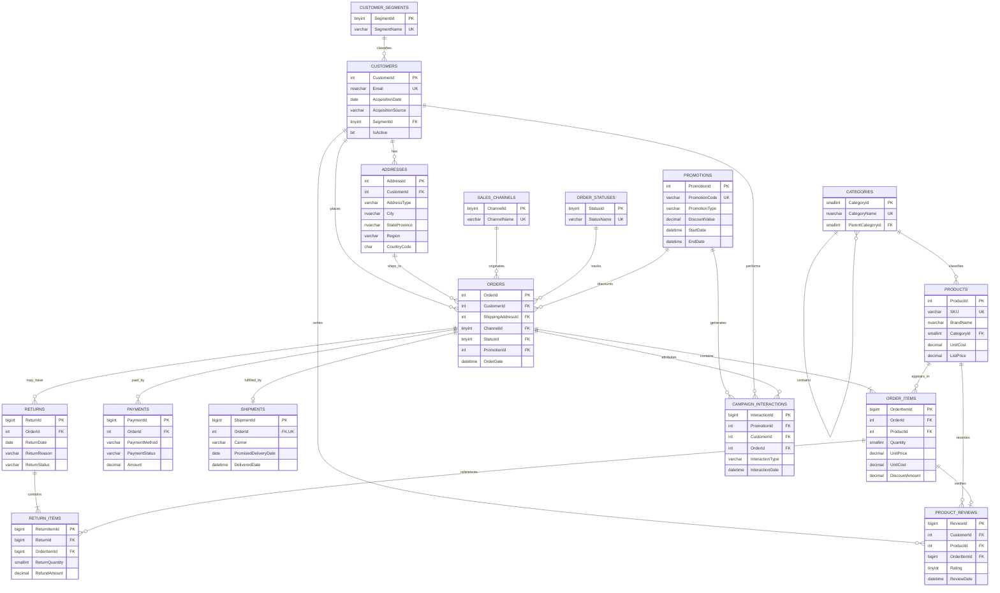

# Entity Relationship Diagram

## Modeling decisions

- Customers and addresses are separated because a customer may maintain multiple billing or shipping addresses.
- Categories are self-referencing, allowing future subcategories without redesigning products.
- Order items snapshot unit price and cost at purchase time to preserve historical margin.
- Payments support multiple attempts or split tenders, although seed data uses one payment per order.
- Returns and return items are separated so one return request can contain multiple order lines.
- Promotions and campaign interactions are separated so exposure, engagement, conversion, and order economics can be analyzed independently.
- Product reviews reference the purchased order line, enabling verified-purchase and return-versus-rating analysis.
- The reporting schema exposes denormalized views; the transactional schema remains normalized.
