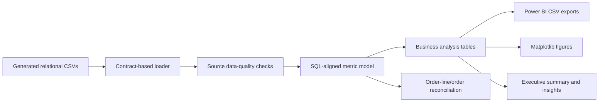

# Python EDA & Business Insights Pipeline

## Purpose

This pipeline turns normalized synthetic transactions into validated analytics tables, quantified business findings, Power BI-ready exports, and presentation-ready charts. A notebook is not the source of truth: all business logic lives in reusable Python modules.

## Architecture



## Package structure

| Module | Responsibility |
|---|---|
| `config.py` | Typed configuration and project-relative path resolution |
| `contracts.py` | Source table schemas and expected-null definitions |
| `io.py` | Chunked CSV loading and deterministic exports |
| `validation.py` | PK/FK, null, range, chronology, outlier, and reconciliation checks |
| `model.py` | SQL-aligned order, customer, cohort, RFM, product, return, review, and campaign metrics |
| `analysis.py` | Curated analysis tables and quantified findings |
| `plots.py` | Presentation-ready matplotlib charts |
| `reporting.py` | Executive Markdown, insight CSV, quality JSON, and run manifest |
| `pipeline.py` | Logging, error handling, and orchestration |

## Run the pipeline

```bash
python -m venv .venv

# Windows
.venv\Scripts\activate

# macOS/Linux
source .venv/bin/activate

pip install -r python/requirements.txt
python -m data_generator.generate
python python/ecommerce_eda.py
```

Use a different configuration:

```bash
python python/ecommerce_eda.py --config path/to/eda_config.json
```

Run calculations and exports without plots:

```bash
python python/ecommerce_eda.py --skip-plots
```

## Configuration

`python/eda_config.json` controls source/output paths, chunk size, figure DPI, top-product count, cohort horizon, RFM snapshot date, and random seed. Paths are resolved relative to the repository root.

## Metric parity with SQL

| Metric | Python definition |
|---|---|
| `NetRevenue` | Valid line quantity × unit price − line discount |
| `RefundAmount` | Refunds linked to non-rejected returns |
| `RevenueAfterRefund` | `NetRevenue − RefundAmount` |
| `GrossProfit` | `NetRevenue − COGS` |
| `GrossProfitAfterRefund` | Conservative proxy: `GrossProfit − RefundAmount` |

The pipeline aggregates line metrics to order grain and requires every metric to reconcile within one cent. Cancelled orders report zero revenue, COGS, and profit, matching the SQL views.

## Data quality

The run fails on:

- missing files or required columns;
- null or duplicate primary keys;
- orphan customer, order, product, return, or review relationships;
- negative quantity/economic values;
- discounts above gross line value;
- invalid review ratings;
- impossible shipment chronology;
- order/line metric reconciliation differences.

Expected nulls are modeled explicitly—for example parent categories, non-conversion campaign order IDs, and undelivered shipment dates. IQR-based high-value line observations are reported, not automatically removed.

## Memory and performance

- Large facts are read in configurable chunks.
- Only reusable facts remain at detailed grain; most analyses use compact aggregates.
- Merge cardinality is asserted with pandas `validate=` arguments.
- Outputs are written independently so Power BI can load only required tables.
- At substantially larger scale, replace final chunk concatenation with Parquet/Polars/DuckDB or push transformations into SQL Server.

## Outputs

### Reports

- `reports/EXECUTIVE_SUMMARY.md`
- `reports/business_insights.csv`
- `reports/data_quality_report.json`
- `reports/analysis_manifest.json`
- `reports/eda_pipeline.log`

### Figures

Twelve numbered PNG files are written to `reports/figures/`. Every title is phrased as a business question, axes use explicit units, bar charts start at zero, and non-zero growth scales are symmetric around zero.

### Power BI tables

The pipeline writes facts, dimensions, analytical aggregates, RFM, cohort, Pareto, campaign, delivery, discount, and review-return tables to `data/processed/`.

## Methodological limitations

- Synthetic data supports demonstration, not market benchmarking.
- Direct campaign attribution is not incremental lift.
- Discount comparisons are observational and affected by self-selection.
- Projected 12-month value is an explainable annual run rate, not a probability model.
- Churn status is rules-based and depends on observed purchase cadence.
- Recent cohorts are right-censored.
- Review rating and return behavior are associated in the generated model; the analysis does not establish causality.
- Campaign cost, shipping expense, overhead, and returned-item recovery are unavailable.

## Tests

```bash
python -m unittest discover -s tests -v
```

Tests cover configuration, deterministic weighted sampling, calendar behavior, MoM/YoY/running revenue, deterministic RFM, SQL object contracts, and SQL/Python analytical coverage.
