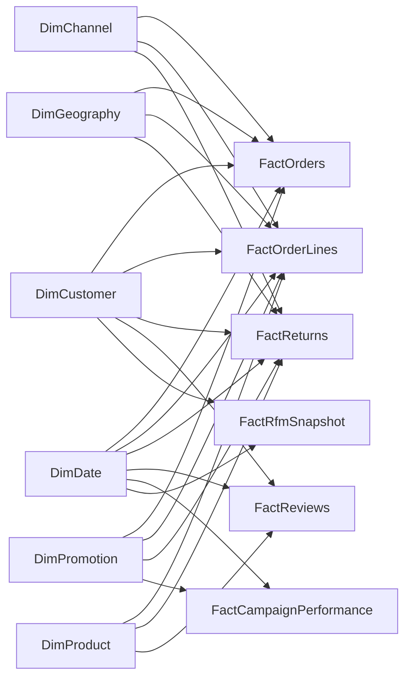

# Power BI Semantic Model Guide

## Purpose

This model is designed for governed self-service analytics: reusable measures, explicit fact grains, conformed dimensions, predictable filter propagation, and no hidden fact-to-fact joins. The SQL analytics views are the preferred production source; the deterministic CSV exports provide an offline portfolio path with the same metric definitions.

## Source strategy

Use an Import model for the portfolio dataset. Parameterize `SourceType`, `SqlServerName`, `DatabaseName`, and `CsvRoot` in Power Query so the report can switch between SQL Server and CSV without redesigning the model.

| Semantic table | CSV source | Grain | Role |
|---|---|---|---|
| `FactOrders` | `fact_orders.csv` | One row per order | Order economics, customers, channel, geography, delivery |
| `FactOrderLines` | `fact_order_lines.csv` | One row per order item | Product volume, margin, discounts, product returns |
| `FactReturns` | `fact_returns.csv` | One row per returned order item | Return reason, quantity, refund exposure |
| `FactReviews` | `fact_reviews.csv` | One row per review | Rating, verification, helpfulness, observed return behavior |
| `FactCampaignPerformance` | `campaign_performance.csv` | One row per promotion | Funnel and directly attributed economics |
| `FactCohortRetention` | `cohort_retention.csv` | One row per cohort and elapsed month | Retention heatmap |
| `FactRfmSnapshot` | `rfm_segments.csv` | One row per customer at snapshot date | RFM and churn prioritization |
| `DimDate` | `dim_date.csv` | One row per date | Conformed calendar |
| `DimCustomer` | `dim_customers.csv` | One row per customer | Acquisition, segment, lifecycle, historical value |
| `DimProduct` | `dim_products.csv` | One row per product | Product, brand, category hierarchy |
| `DimChannel` | `dim_channels.csv` | One row per channel | Sales channel |
| `DimGeography` | `dim_geography.csv` | One row per city/state/region combination | Regional hierarchy |
| `DimPromotion` | `dim_promotions.csv` | One row per promotion | Campaign attributes and validity period |

The aggregate exports (`monthly_performance`, `product_performance`, `category_performance`, `delivery_performance`, and similar files) are reconciliation assets. When all CSVs must be imported, load them with the `Validation*` names in `table_manifest.csv`, keep them disconnected, hide them from report view, and never use them as substitutes for governed atomic-fact measures. This preserves complete source coverage without creating inconsistent totals.

## Star schema

`FactCohortRetention` is an intentional analytical island. Its cohort date and elapsed-month axes describe a matrix, not ordinary transaction-date filtering. Keeping it disconnected avoids misleading propagation from the report date slicer.

## Relationships

All listed relationships are `1:*`, active, and single-direction from dimension to fact unless noted otherwise.

| Dimension key | Fact key(s) |
|---|---|
| `DimDate[DateKey]` | `FactOrders[OrderDateKey]`, `FactOrderLines[OrderDateKey]`, `FactReturns[ReturnDateKey]`, `FactReviews[ReviewDateKey]`, `FactCampaignPerformance[StartDateKey]`, `FactRfmSnapshot[SnapshotDateKey]` |
| `DimCustomer[CustomerId]` | `FactOrders`, `FactOrderLines`, `FactReturns`, `FactReviews`, `FactRfmSnapshot` |
| `DimProduct[ProductId]` | `FactOrderLines`, `FactReturns`, `FactReviews` |
| `DimChannel[ChannelId]` | `FactOrders`, `FactOrderLines`, `FactReturns` |
| `DimGeography[GeographyKey]` | `FactOrders`, `FactOrderLines`, `FactReturns` |
| `DimPromotion[PromotionId]` | `FactOrders`, `FactOrderLines`, `FactReturns`, `FactCampaignPerformance` |

Never relate `FactOrders` to `FactOrderLines` or `FactReturns`. `OrderId` is a degenerate dimension used for drill-through and audit tables, not a relationship key. This prevents order revenue from being repeated at line grain and removes ambiguous filter paths.

If shipped, promised, or delivered date analysis is required, add inactive relationships from `DimDate[DateKey]` to corresponding integer date keys and activate them inside dedicated measures with `USERELATIONSHIP`. Do not use bidirectional filtering as a shortcut.

## Model configuration

- Mark `DimDate[FullDate]` as the date table and disable Auto date/time.
- Sort `MonthName` by `MonthNumber`; sort `YearMonth` by a numeric `YearMonthSort` created in Power Query if needed.
- Create an empty `_Measures` table and place all measures in display folders.
- Hide surrogate keys, foreign keys, raw numeric columns, free-text review fields, and technical date keys from report view.
- Set fact numeric columns to `Do not summarize`; users should consume measures.
- Use `CategoryName > SubcategoryName > ProductName` and `Region > StateProvince > City` hierarchies.
- Format currency as `$#,0;($#,0);-`, percentages as `0.0%`, counts as `#,0`, and durations as `0.0 days`.
- Use explicit measure descriptions from `MEASURE_DICTIONARY.md` and assign data categories to geography fields.
- Import all CSVs through the typed definitions in `power_query/QUERY_CATALOG.md`; keep the nine `Validation*` aggregate tables disconnected and hidden.

## Measure governance

The canonical definitions remain:

- `Revenue` = non-cancelled gross revenue less line discount (`NetRevenue`).
- `Revenue After Refund` = `NetRevenue - non-rejected RefundAmount`.
- `Gross Profit` = `NetRevenue - COGS`.
- `Gross Profit After Refund` = `GrossProfit - non-rejected RefundAmount`.
- `Average Order Value` = `Revenue / non-cancelled distinct orders`.
- `Return Rate` = non-rejected returned units / valid units sold.

Measures must reference the fact matching the visual grain. Order-level KPIs use `FactOrders`; product KPIs use `FactOrderLines`; return reason KPIs use `FactReturns`. Never mix raw columns from different facts in one visual without a measure.

## Performance and refresh

- Keep Power Query transformations foldable for SQL Server; use the analytics views and select only required columns.
- Use integer surrogate keys and low-cardinality dimensions for compression. Keep review text out of the main report unless a drill-through page requires it.
- Prefer Import mode at this scale. Use incremental refresh on `OrderDate`, `ReturnDate`, and `ReviewDate` only when the source grows materially.
- Validate with Performance Analyzer and DAX Studio: remove unused columns, inspect storage size, and target interactive visuals below two seconds.
- Limit each page to decision-relevant visuals, avoid high-cardinality legends, and use field parameters only where they reduce duplicated visuals.
- Configure an on-premises gateway for SQL Server refresh; store credentials in the Power BI Service, never in repository files.

## Validation checklist

1. `Revenue`, `Revenue After Refund`, `Gross Profit`, `Gross Profit After Refund`, `Refund Amount`, and order counts reconcile to SQL views and Python exports.
2. Dimension keys are unique and fact foreign keys have no unexpected blanks.
3. Date, channel, geography, promotion, customer, and product slicers propagate only from dimensions.
4. A table containing `OrderId` and `Revenue` shows one amount per order; product visuals use line-fact measures.
5. Time-intelligence measures return blanks when no comparable period exists rather than false zero growth.
6. Cohort matrix totals are disabled or interpreted carefully because elapsed-month rates are non-additive.

## Build order

1. Import and type dimensions, then facts.
2. Create relationships exactly as documented.
3. mark the date table, add hierarchies, and hide technical fields.
4. Create `_Measures`, paste `measures.dax`, and apply display folders and formats from `MEASURE_DICTIONARY.md`.
5. Apply `theme.json` and build the six pages from `BUILD_POWERBI.md`.
6. Reconcile core totals before adding bookmarks, drill-through, or publishing.
